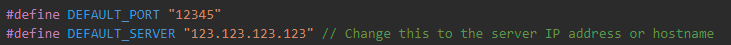
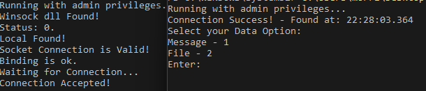

# TCP Server & Client in C/C++

## Usage 
Client and server that will accept and send messages or files.

## Requirements
To run, you will need to have the following installed:

    -C++ Compiler

## How to Install
### Step 1: Clone Repo and Insert your own IPV4 Address and Port. 
   `git clone https://github.com/AJ-OS/TCP-Client-Server-Cpp`

### Step 2: Edit the `client.cpp` and `server.cpp` files to insert your IPV4 address and Port.

### Step 3: Compile each script with terminal (Unix-like) or PowerShell (Windows) with administrative access.

